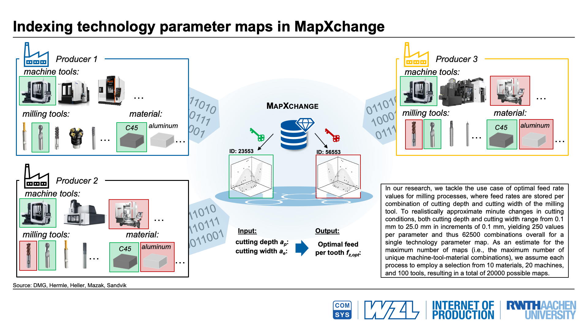
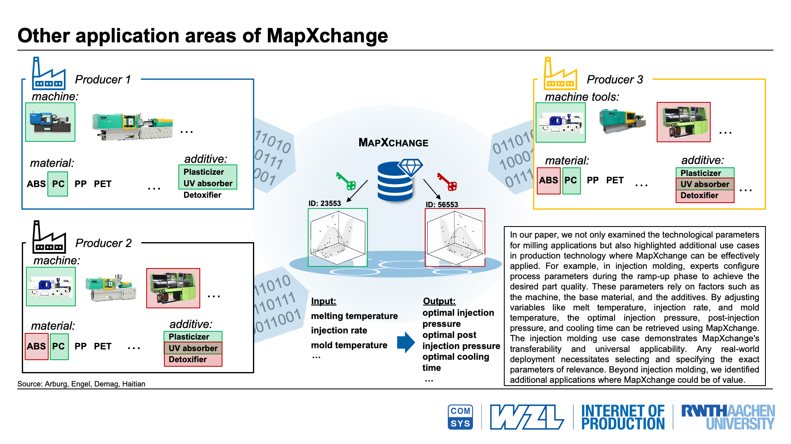

# MapXchange

This repository contains a fully-tested prototype of MapXchange, our privacy-preserving exchange platform for technology parameter maps.

## About

> Technology parameter maps summarize experiences with specific parameters in production processes, e.g., milling, and significantly help in designing new or improving existing production processes. Businesses could greatly benefit from globally exchanging such existing knowledge across organizations to optimize their processes. Unfortunately, confidentiality concerns and the lack of appropriate designs in existing data space frameworks—both in academia and industry—greatly impair respective actions in practice. To address this research gap, we propose MapXchange, our homomorphic encryption-based approach to combine technology parameters from different organizations into technology parameter maps while accounting for the confidentiality needs of involved businesses. Central to our design is that it allows for local modifications (updates) of these maps directly at the exchange platform. Moreover, data consumers can query them, without involving data providers, to eventually improve their setups. By evaluating a real-world use case in the domain of milling, we further underline MapXchange's performance, security, and utility for businesses.

## Publication

* Jan Pennekamp, Joseph Leisten, Paul Weiler, Markus Dahlmanns, Marcel Fey, Christian Brecher, Sandra Geisler, and Klaus Wehrle: *MapXchange: Designing a Confidentiality-Preserving Platform for Exchanging Technology Parameter Maps*. In Proceedings of the 40th ACM/SIGAPP Symposium on Applied Computing (SAC '25), ACM, 2025.

If you use any portion of our work, please cite our publication.

```
@inproceedings{pennekamp2025mapxchange,
    author = {Pennekamp, Jan and Leisten, Joseph and Weiler, Paul and Dahlmanns, Markus and Fey, Marcel and Brecher, Christian and Geisler, Sandra and Wehrle, Klaus},
    title = {{MapXchange: Designing a Confidentiality-Preserving Platform for Exchanging Technology Parameter Maps}},
    booktitle = {Proceedings of the 40th ACM/SIGAPP Symposium on Applied Computing (SAC '25)},
    year = {2025},
    month = {April},
    publisher = {ACM},
    doi = {10.1145/3672608.3707734}
}
```

## License

This program is free software: you can redistribute it and/or modify it under the terms of the GNU General Public License as published by the Free Software Foundation, either version 3 of the License, or (at your option) any later version.

This program is distributed in the hope that it will be useful, but WITHOUT ANY WARRANTY; without even the implied warranty of MERCHANTABILITY or FITNESS FOR A PARTICULAR PURPOSE. See the GNU General Public License for more details.

You should have received a copy of the GNU General Public License along with this program. If not, see <http://www.gnu.org/licenses/>.

If you are planning to integrate parts of our work into a commercial product and do not want to disclose your source code, please contact us for other licensing options via email at pennekamp (at) comsys (dot) rwth-aachen (dot) de

---

## Addditional Infomration

### Real-World Data

*Provided by the [Laboratory for Machine Tools and Production Engineering (WZL)](https://www.wzl.rwth-aachen.de/) of [RWTH Aachen](https://www.rwth-aachen.de/)*

- Dataset: `data/real_world_record.txt`

The dataset consists of 30 entries, each composed of 2 input and 2 output parameters.
As this data has been obtained from real-world processes, expert knowledge is contained within.
However, to prevent said knowledge from being made freely accessible, we slightly altered each parameter value.

The input parameters define cutting depth (ap) and cutting width (ae), while the output parameters define feed per tooth (fz) and usage.
Because usage is an essential part of our platform but not contained in the provided data, the corresponding value is 0 for every entry.
As each entry of this dataset has unique input parameters, the set yields 30 unique identifiers.

### Indexing Approach



### Transferability




---

# Artifacts

## System Requirements

Our Python prototype is intended for Linux and has been tested on Ubuntu 20.04 and 22.04.
During our evaluation measurements, maximum memory consumption never exceeded 1 GB.

## Libraries

As listed in `requirements.txt`, we employ the following Python libraries in our work:

- Flask-SQLAlchemy (https://github.com/pallets-eco/flask-sqlalchemy)
- flask-httpauth (https://github.com/miguelgrinberg/Flask-HTTPAuth)
- matplotlib (https://github.com/matplotlib/matplotlib)
- memory_profiler (https://github.com/pythonprofilers/memory_profiler)
- phe (https://github.com/data61/python-paillier)
- requests (https://github.com/psf/requests)
- responses (https://github.com/getsentry/responses)
- scipy (https://github.com/scipy/scipy)
- tcconfig (https://github.com/thombashi/tcconfig)
- tqdm (https://github.com/tqdm/tqdm)

No changes have been made to any of the employed libraries.

## Setup

1. Checkout repository with `git clone git@github.com:COMSYS/MapXchange.git`
2. Execute `pip install -r requirements.txt` in root dir
3. Execute `sudo setcap cap_net_admin+ep TCPATH`, where TCPATH points to the installation of tcconfig (e.g., /usr/sbin/tc)
4. Ensure for `src/lib/helpers.py` that subprocess commands in `start_trans_measurement()`, `read_tcpstat_from_file()`, `kill_tcpdump()`, `reset_tc()`, and `set_tc()` can be executed (i.e., by adjusting sudo privileges and/or executable paths)

## Directory Structure

- Global configurations are stored in `src/lib/config.py`
- TLS certificates are stored in `data/certs`
- Logs are written to `data/logs`

## Usage

All scripts have to be started from within the root directory.

### Unittests

		python3 -m unittest

### User Creation

1. Create users:

	We provide a script for the registration of producers.
	See the script's help for usage information:

		python3 -m src.producer_db_cli --help

	**Example:**

		python3 -m src.producer_db_cli --add USERNAME PASSWORD

	**Both servers have to be restarted after modification of the user database!**

### Starting Servers

The server instances can be started using the script `src/allStart.sh`, which creates a tmux session *Server* with key and map server.
They can also be started manually as follows.

1. Start the key server:

		src/startKeyServer.sh

2. Start the map server:

		src/startMapServer.sh

### Producer Application
*Servers must be running*

**Usage:**

			python3 -m src.producer --help

**Examples:**

1. Provide records from file:

			python3 -m src.producer USERNAME PASSWORD -f FILEPATH
		FILEPATH, e.g., `./data/real_world_record.txt`

2. Pose regular query:

			python3 -m src.producer USERNAME PASSWORD -m MAPNAME -a APAE
		MAPNAME, e.g., `('5rLhPSFu', 'hardened steel', 'zJcgKqGI')`
		APAE, e.g., 1,2 3,4 5,6

3. Pose reverse query:

			python3 -m src.producer USERNAME PASSWORD -t PROPERTIES
		PROPERTIES, e.g., `('5rLhPSFu', 'hardened steel'), ('end mill', 4)`

4. Choose tool after reverse query:

			python3 -m src.producer USERNAME PASSWORD -i MAPID

## Evaluation

**All evaluation scripts need to be started from the root directory with the command `python3 -m src.eval.NAME OPTIONS`.
The server instances DO NOT need to be running; they are started automatically if necessary.**

All evaluation scripts provide a user manual with the command line option `--help`.

		python3 -m src.eval.NAME --help

All evaluation scripts are located in `eval/`. Accordingly, all filenames are relative to this base directory.

### Paillier Evaluation

		python3 -m src.eval.paillier -o FILENAME

### Provision Evaluation

		python3 -m src.eval.provision OPTIONS -o FILENAME

**Options:**

- `--stored (-s) NUMBER`: Number of values stored per point.
- `--paillier (-p)`: Deactivate Paillier.
- `--tls (-t)`: Deactivate TLS.
- `--ram (-r)`: Deactivate RAM measurement.
- `--invalid`: Deactivate validation.
- `--real`: Use real-world data.

**Examples:**

	ID 1: python3 -m src.eval.provision -o provision_0 -s 0
	ID 2: python3 -m src.eval.provision -o provision_1_r_invalid -s 1 -r
    ID 3: python3 -m src.eval.provision -o provision_1_r_invalid_real -s 1 -r  --invalid --real
	ID 4: python3 -m src.eval.provision -o provision_3_r -s 3 -r

### Regular Query Evaluation

		python3 -m eval.regular_query OPTIONS -o FILENAME

**Options:**

- `--stored (-s) NUMBER`: Number of values stored per point.
- `--paillier (-p)`: Deactivate Paillier.
- `--tls (-t)`: Deactivate TLS.
- `--ram (-r)`: Deactivate RAM measurement.
- `--invalid`: Deactivate validation.
- `--real`: Use real-world data.
- `--full`: Use full map (62500 points).

**Examples:**

	ID 1: python3 -m src.eval.regular_query -o regular_1_ptr -ptr
	ID 2: python3 -m src.eval.regular_query -o regular_1_r_invalid_real -r --invalid --real
	ID 3: python3 -m src.eval.regular_query -o regular_3_r_full -s 3 -r --full

### Reverse Query Evaluation

		python3 -m eval.reverse_query OPTIONS -o FILENAME

**Options:**

- `--paillier (-p)`: Deactivate Paillier.
- `--tls (-t)`: Deactivate TLS.
- `--ram (-r)`: Deactivate RAM measurement.
- `--invalid`: Deactivate validation.

**Examples:**

	ID 1: python3 -m src.eval.reverse_query -o reverse_tr -tr
	ID 2: python3 -m src.eval.reverse_query -o reverse_r_invalid -r --invalid

## Plotting

The following commands can be used to replicate the plots from our paper:

	python3 -m eval_results.scripts.plot_provision
	python3 -m eval_results.scripts.plot_regular_query
	python3 -m eval_results.scripts.plot_reverse_query

Besides the respective plot being saved to `eval_results/plots`, means and deviations for real-world data are printed to the console.
